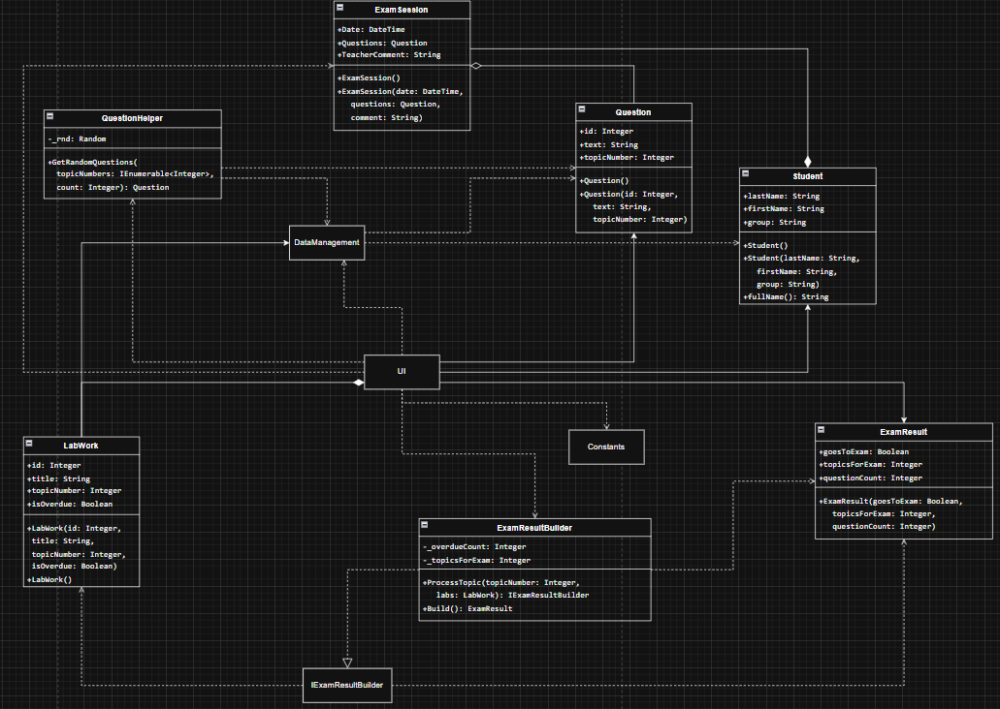
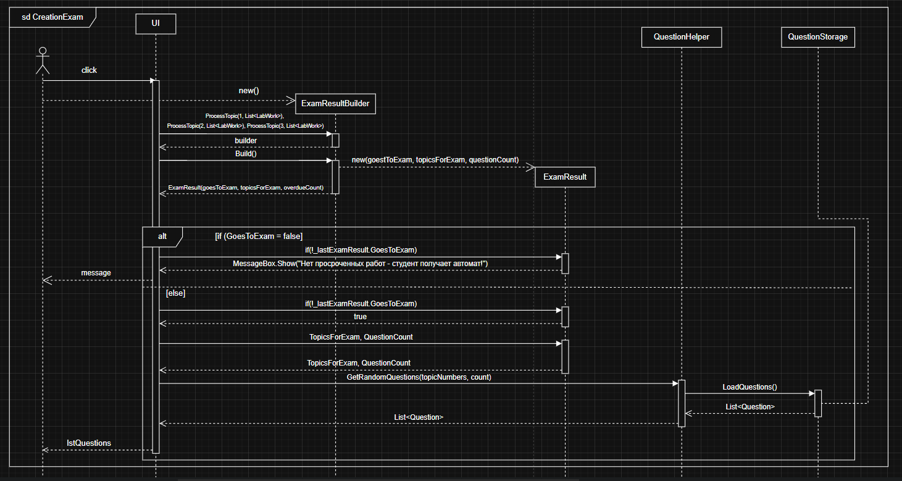

# Лабораторная работа: паттерн Builder

## 1. Описание проблемы

Приложение «Экзаменационный калькулятор» автоматизирует процесс допуска студентов к экзамену. Студенты выполняют 10 лабораторных работ по трём темам. Если все работы сданы в срок — автомат. Если есть просрочки — формируется билет с вопросами по проблемным темам.

Без паттерна логика подсчёта просрочек, определения тем и формирования результата находится прямо в обработчике кнопки — внутри UI-кода. Это смешивает ответственности: форма одновременно управляет интерфейсом и выполняет бизнес-логику. Такой код сложнее поддерживать, тестировать и переиспользовать.

## 2. Решение: применение паттерна Builder

Паттерн Builder отделяет пошаговое конструирование объекта от его представления.

В проекте введены:

- **`IExamResultBuilder`** — интерфейс строителя с методами `ProcessTopic()` и `Build()`
- **`ExamResultBuilder`** — реализация, которая на каждом шаге анализирует тему, накапливает просрочки и в конце создаёт результат
- **`ExamResult`** — продукт строителя: флаг допуска, список тем, количество вопросов

Процесс в коде:

```csharp
var builder = new ExamResultBuilder();
builder.ProcessTopic(1, labsTopic1);
builder.ProcessTopic(2, labsTopic2);
builder.ProcessTopic(3, labsTopic3);
var result = builder.Build();
```
## 3. Диаграмма классов


Ключевые связи:

Тип связи	Откуда → Куда
Реализация	ExamResultBuilder → IExamResultBuilder
Зависимость	IExamResultBuilder → LabWork, ExamResult
Зависимость	MainForm → ExamResultBuilder
Композиция	Student → ExamSession (1 : *)
Агрегация	ExamSession → Question (* : *)
Ассоциация	MainForm → Student, ExamResult, Question
## 4. Диаграмма последовательностей


Описывает процесс выдачи билета по несданным темам:

Преподаватель нажимает «Рассчитать»
MainForm создаёт ExamResultBuilder
Трижды вызывается ProcessTopic() — по одному разу на каждую тему
Вызывается Build() → создаётся ExamResult
Если GoesToExam == false — сообщение «автомат», конец
Если true — QuestionHelper загружает вопросы из QuestionStorage и возвращает случайные по нужным темам
Вопросы отображаются преподавателю

## 5. Сравнение: без паттерна и с паттерном
Без паттерна — логика в обработчике кнопки:

```csharp
private void BtnCalculate_Click(object sender, EventArgs e)
{
    int overdueCount = 0;
    var topicsForExam = new List<int>();
    for (int topic = 1; topic <= 3; topic++)
    {
        var overdue = _labWorks.Where(l => l.TopicNumber == topic && l.IsOverdue).ToList();
        if (overdue.Any()) { topicsForExam.Add(topic); overdueCount += overdue.Count; }
    }
    _lastExamResult = new ExamResult(overdueCount > 0, topicsForExam, overdueCount);
}
```
С паттерном — логика в отдельном классе:

```csharp

private void BtnCalculate_Click(object sender, EventArgs e)
{
    var builder = new Builders.ExamResultBuilder();
    builder.ProcessTopic(1, _labWorks.Where(l => l.TopicNumber == 1).ToList());
    builder.ProcessTopic(2, _labWorks.Where(l => l.TopicNumber == 2).ToList());
    builder.ProcessTopic(3, _labWorks.Where(l => l.TopicNumber == 3).ToList());
    _lastExamResult = builder.Build();
}
```
## 6. Вывод
Применение паттерна Builder позволило:

Разделить ответственности — бизнес-логика вынесена из UI в отдельный класс
Обеспечить расширяемость — через интерфейс IExamResultBuilder можно подменить реализацию с другими правилами допуска
Упростить тестирование — строитель тестируется отдельно от формы
Повысить читаемость — цепочка ProcessTopic → Build наглядно отражает пошаговое построение результата

Функциональность приложения идентична в обоих вариантах. Разница — во внутренней организации кода.
